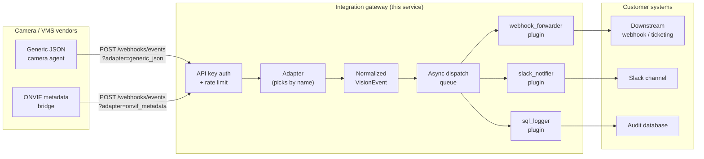
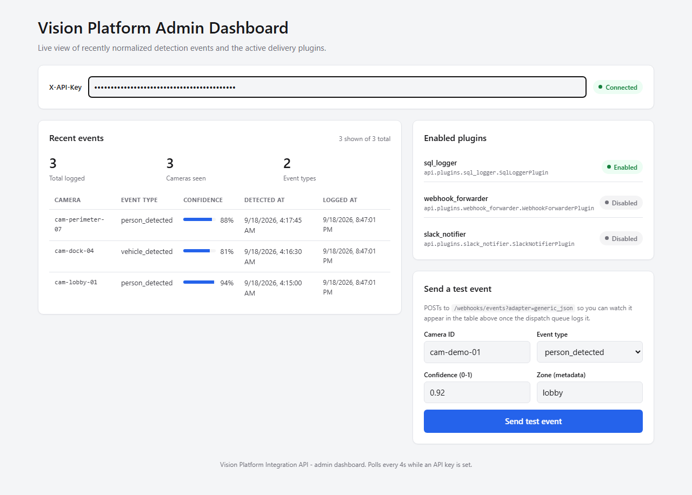

# Vision Platform Integration API

A small REST gateway that sits between an AI video-analytics platform and a customer's
existing tools (ticketing systems, chat, SIEMs, audit databases, ...). Camera and VMS
(video management system) vendors all send detection events in their own shape - this
service takes those different payloads in, turns them into one common event format, and
then hands each event off to whichever downstream systems the customer actually uses. In
other words: it's the plumbing that lets "a camera saw something" turn into "the right
system got told about it," no matter which camera vendor or which downstream tool is
involved.

## Why this matters

Every customer's environment is different. One site's cameras speak ONVIF metadata,
another's analytics box already emits clean JSON, and the customer wants the result in
Slack, in a ticketing webhook, and in an audit log they can query later. Writing bespoke
glue code for every vendor-times-destination combination doesn't scale - it turns into a
pile of one-off scripts that nobody wants to touch. This project is the shape that scales
instead: normalize once, then fan out through small, independent, swappable pieces. It's
the same pattern you'd reach for in any day-to-day integration job, not something tied to
one specific platform or vendor.

## Architecture



Request path, left to right: a vendor POSTs its own payload shape to
`/webhooks/events`, telling the API which adapter to use. Auth and rate limiting are
checked first. The adapter turns the payload into a `VisionEvent`, which is dropped on an
in-memory queue. The HTTP response goes back immediately. In the background, worker tasks
pull events off the queue and run every enabled plugin against them, each plugin talking
to one downstream system.

## Design decisions

**Why a webhook receiver instead of having the platform poll a queue.**
A webhook is push, not pull - the platform already knows the moment an event happens, so
it should just tell us, once, over HTTP. Making the platform poll a queue would mean it
either polls too often (wasted load) or too rarely (delayed alerts), and it adds an extra
piece of infrastructure (the queue itself) that the vision platform's team would need to
provision and trust. A `POST` endpoint is something almost every vendor and platform can
already do, with no new infrastructure on their side.

**Why a normalization/adapter layer.**
Different camera/VMS vendors do not agree on field names, nesting, units, or even what
"confidence" means. Without a normalization step, every plugin (webhook forwarder, Slack
notifier, SQL logger, future integrations) would need its own copy of vendor-specific
parsing logic, and adding a new vendor would mean touching every plugin. Concentrating
that translation in one adapter per vendor means adding vendor #3 is "write one new
adapter," not "audit and update every plugin."

**Why a plugin pattern instead of hardcoding each integration in the request handler.**
Hardcoding "call the webhook, then post to Slack, then write to SQL" directly in the
endpoint means every new destination requires editing and re-testing the request handler,
and a bug in the Slack code can take down the webhook forwarding too. Plugins are
independent units that only need to implement `handle_event`; enabling, disabling, or
adding one is a one-line change in `config/plugins.yaml`, and one plugin's failure is
isolated from the others by the dispatch queue (see below).

**Why an async background dispatch queue with retry/backoff.**
The receiver endpoint's job is to accept and normalize an event - it has no business
waiting on a customer's downstream webhook that might be slow or temporarily down. If the
endpoint called plugins directly and synchronously, one slow or flaky downstream system
would make every event ingestion slow, and a long enough stall could make the vision
platform's own webhook call time out and retry, causing duplicate events. Queueing the
event and returning immediately decouples "did we accept this event" from "did every
downstream system successfully receive it." Retries with exponential backoff give
transient network blips (a downstream service restarting, a brief timeout) a real chance
to succeed without hammering a struggling endpoint or blocking the queue for everyone
else.

**Why simple API-key auth instead of OAuth2.**
This endpoint exists for server-to-server delivery: one system (the vision platform)
calling one endpoint (ours) with credentials it was handed once, ahead of time. There is
no end user, no browser redirect, and no need for scoped, expiring, refreshable tokens -
a static, revocable API key checked on every request covers the actual threat model (a
leaked key) just as well, with far less code and far fewer moving parts to misconfigure.
OAuth2's authorization-code dance, token refresh, and client registration flows solve
problems (delegated user consent, third-party app access) that simply don't exist here;
adding it would be complexity with no corresponding benefit. A larger enterprise rollout
with many independent client systems, or a requirement to avoid any shared static secret,
is exactly the point where OAuth2 (client-credentials grant) or mutual TLS start to earn
their cost - see the hardening notes below.

## Setup & run

### Option A: local virtual environment

```bash
git clone <this-repo-url>
cd vision-platform-integration-api

python -m venv .venv
# Windows:
.venv\Scripts\activate
# macOS/Linux:
source .venv/bin/activate

pip install -r requirements.txt

# Start the API (reads config/plugins.yaml; the SQL logger plugin is on by default)
uvicorn api.main:app --app-dir src --reload
```

The API is now at `http://127.0.0.1:8000`. Interactive docs are at
`http://127.0.0.1:8000/docs`.

Mint a local API key (stores only its hash - the raw key is printed once):

```bash
python scripts/create_api_key.py "local-dev"
# API key created. This is shown only once - store it securely.
#   name: local-dev
#   key:  <your-key-will-print-here>
```

Send a sample event:

```bash
curl -X POST "http://127.0.0.1:8000/webhooks/events?adapter=generic_json" \
  -H "X-API-Key: <your-key>" \
  -H "Content-Type: application/json" \
  -d '{
        "camera_id": "cam-01",
        "event_type": "person_detected",
        "confidence": 0.92,
        "bounding_box": {"x": 0.1, "y": 0.2, "width": 0.3, "height": 0.4},
        "timestamp": "2026-09-18T12:00:00Z",
        "metadata": {"zone": "lobby"}
      }'
```

You should get back `202 Accepted` with the normalized event, and (with the default
config) a new row in `data/events.db`.

Try the other adapter with an ONVIF-metadata-shaped payload:

```bash
curl -X POST "http://127.0.0.1:8000/webhooks/events?adapter=onvif_metadata" \
  -H "X-API-Key: <your-key>" \
  -H "Content-Type: application/json" \
  -d '{
        "UtcTime": "2026-09-18T12:00:05.123Z",
        "Source": {"VideoSourceConfigurationToken": "cam-07"},
        "Data": {
          "Frame": {
            "ObjectId": "12",
            "ClassDescriptor": {"ClassCandidate": [{"Type": "Human", "Likelihood": 0.87}]},
            "BoundingBox": {"left": 100, "top": 50, "right": 300, "bottom": 400}
          }
        }
      }'
```

### Option B: Docker Compose

```bash
docker compose up --build
```

This builds the image and starts the API on `http://localhost:8000`, with `./data` and
`./config` mounted from the host so the SQLite files and plugin config persist across
restarts. Mint a key and send events the same way as above (or run
`python scripts/create_api_key.py` on the host against `./data/api_keys.db`, since it's
the same file the container reads).

To turn on the Slack notifier or webhook forwarder, edit `config/plugins.yaml`
(`enabled: true`) and set the matching environment variable (e.g. `SLACK_WEBHOOK_URL`) in
`docker-compose.yml` or your shell - never commit a real webhook URL.

### Read-only endpoints (list events, stats, plugin config)

Three small, additive, read-only endpoints exist alongside the webhook receiver, all
protected by the same `X-API-Key` auth dependency:

- **`GET /events/recent?limit=50`** - the most recently logged events, newest first, read
  straight from the same SQLite table the `sql_logger` plugin already writes (no second,
  divergent store). Returns a JSON list of normalized events plus `received_at` (when this
  service persisted the row).
- **`GET /events/stats`** - aggregate counts over that same table: `total_events`,
  `events_by_type`, `events_by_camera`.
- **`GET /plugins`** - reflects `config/plugins.yaml` back as data (`name`, `module`,
  `class_name`, `enabled`) without importing/instantiating anything, so you can see what's
  configured without reading the YAML by hand.

```bash
curl -H "X-API-Key: <your-key>" "http://127.0.0.1:8000/events/recent?limit=10"
curl -H "X-API-Key: <your-key>" "http://127.0.0.1:8000/events/stats"
curl -H "X-API-Key: <your-key>" "http://127.0.0.1:8000/plugins"
```

These three endpoints are what the [admin dashboard](#admin-dashboard) below is built on.

## Admin Dashboard



A small React + TypeScript admin dashboard lives in `frontend/`. It shows a live table of
recently normalized events (camera, event type, confidence, timestamps) pulled from
`GET /events/recent`, a panel of which plugins are enabled (from `GET /plugins`), and a
form that POSTs a sample payload to `/webhooks/events` so you can watch an event go from
submission to appearing in the table in real time. The screenshot above is a genuine
capture of the dashboard running against a live backend seeded with real events sent
through the actual `/webhooks/events` endpoint - not a mockup.

### Run it locally

```bash
# 1. Start the backend (see "Setup & run" above) and mint a dev API key
uvicorn api.main:app --app-dir src --reload
python scripts/create_api_key.py "dashboard-dev"

# 2. Start the dashboard
cd frontend
npm install
npm run dev
```

Open the dashboard (Vite prints the local URL, typically `http://localhost:5173`), paste
the API key from step 1 into the "X-API-Key" field at the top, and the events table,
stats, and plugin panel will populate. Use the "Send a test event" form to fire a sample
detection at `/webhooks/events?adapter=generic_json` and watch it appear in the table on
the next poll (every 4 seconds).

By default the dashboard talks to `http://127.0.0.1:8000` (the standard local `uvicorn`
address). To point it at a different backend (e.g. Docker Compose), copy
`frontend/.env.example` to `frontend/.env.local` and set `VITE_API_BASE_URL`.

### Run it with Docker Compose

`docker compose up --build` now also builds and starts `dashboard-ui` (a multi-stage
`frontend/Dockerfile`: `npm run build` in a Node stage, served by nginx) on
`http://localhost:8080`, alongside the existing `api` service on `http://localhost:8000`.

### Type checking and build

```bash
cd frontend
npm install
npx tsc -b --noEmit   # zero errors
npm run build          # production build to frontend/dist/
```

## Project structure

```
vision-platform-integration-api/
├── src/api/
│   ├── main.py                 # FastAPI app: routes, startup/shutdown wiring
│   ├── models.py                # VisionEvent / BoundingBox schema
│   ├── auth.py                  # API-key storage + FastAPI auth dependency
│   ├── ratelimit.py              # In-memory token-bucket rate limiter
│   ├── dispatch.py               # Async queue + retry/backoff worker loop
│   ├── config.py                 # Environment-driven settings
│   ├── adapters/
│   │   ├── base.py               # Adapter interface
│   │   ├── generic_json.py       # Adapter for an already-normalized-ish payload
│   │   ├── onvif_metadata.py     # Adapter for an ONVIF-metadata-shaped payload
│   │   └── timeutil.py           # Shared timestamp parsing helper
│   └── plugins/
│       ├── base.py               # Plugin interface
│       ├── loader.py             # Dynamic plugin loading from YAML
│       ├── webhook_forwarder.py  # POSTs events downstream, retryable
│       ├── slack_notifier.py     # Posts to a Slack incoming webhook
│       └── sql_logger.py         # Writes events to SQLite for audit/history
├── config/plugins.yaml           # Which plugins are enabled + their config
├── scripts/create_api_key.py     # CLI to mint a local/dev API key
├── tests/                        # pytest suite (see below)
├── frontend/                     # React + TypeScript admin dashboard (see "Admin Dashboard")
│   ├── src/
│   │   ├── App.tsx                # Dashboard UI: events table, plugin panel, test-event form
│   │   ├── types.ts               # TS interfaces mirroring the Pydantic models
│   │   └── api.ts                 # Typed fetch helpers for the backend
│   └── Dockerfile                 # Multi-stage: npm build -> nginx serve
├── docs/screenshots/admin-dashboard.png
├── Dockerfile
├── docker-compose.yml
├── requirements.txt
├── pyproject.toml                # pytest + ruff configuration
└── .github/workflows/ci.yml      # lint + test (Python) and build + typecheck (frontend)
```

## Testing

```bash
pip install -r requirements.txt   # pytest and ruff are included
ruff check .
pytest -v
```

The suite covers:

- **Adapters** - raw vendor payload in, correct `VisionEvent` fields out, for both the
  generic JSON and ONVIF-metadata shapes, including malformed-payload error cases.
- **The webhook endpoint** - valid key + valid payload gets `202` and the event actually
  reaches a plugin (checked via a fake plugin that records calls, not a real network
  call); missing/invalid API key gets `401`/`403`; malformed payloads get `422`.
- **Rate limiting** - hammering the endpoint past a small configured limit reliably
  produces a `429`.
- **Dispatch retry logic** - a fake plugin that fails a fixed number of times then
  succeeds is retried until it does; a plugin that always fails is retried up to its
  configured max and then given up on; a non-retryable plugin's failure never blocks
  other plugins. Backoff delays in tests are configured to be tiny (milliseconds) so the
  suite stays fast.
- **The new read-only endpoints** (`tests/test_events_recent.py`) - events sent through
  the real webhook + dispatch path, logged by the real `SqlLoggerPlugin` (not a fake),
  are read back correctly by `GET /events/recent` and aggregated correctly by
  `GET /events/stats`; both endpoints and `GET /plugins` reject requests without a valid
  API key.

All 29 tests pass locally (`29 passed`), and `ruff check .` is clean.

## Limitations & production hardening notes

This is intentionally a compact, single-instance reference implementation. Before this
runs a real, multi-tenant, high-volume workload, a few things would need to change:

- **Rate limiting**: the token bucket here is an in-memory dict, which only works
  correctly for one process. Running multiple instances behind a load balancer would let
  each instance enforce the limit independently (effectively multiplying it). Redis
  (a shared counter, updated atomically via a small Lua script or `INCR`+`EXPIRE`) is the
  standard fix for a multi-instance deployment.
- **Storage**: SQLite is fine for a single instance or a demo, but doesn't handle
  concurrent writers or large volumes well. Postgres is the natural swap for the API-key
  store and the audit log at scale - both are accessed through a small, contained data
  layer, so the change is localized.
- **Secrets**: API keys are hashed and Slack webhook URLs are read from environment
  variables, which is fine for local/dev but not ideal for a fleet of production
  instances. A secrets manager (Vault, AWS/GCP/Azure secrets services, etc.) is the
  production-grade replacement for both.
- **Stricter auth for larger rollouts**: plain API keys are a reasonable, low-overhead
  choice for a handful of trusted server-to-server integrations (see "Design decisions"
  above). A larger enterprise rollout with many independent client systems, or a
  requirement to avoid any shared static secret, is where mutual TLS or OAuth2
  (client-credentials grant) start to pay for their added complexity.
- **Dead-letter handling**: right now, a plugin delivery that exhausts its retries is
  logged and dropped. At real volume, permanently-failed deliveries should land in a
  dead-letter queue (or table) so they can be inspected and manually replayed instead of
  silently disappearing.
- **Observability**: logging is currently the only signal. Production use would add
  structured logs, metrics (queue depth, delivery latency and failure rate per plugin),
  and distributed tracing so a slow or failing downstream integration is obvious at a
  glance instead of something you have to grep logs to find.

## License

MIT - see [LICENSE](LICENSE).

---


### Thank you for reading

#### Please consider giving a star if you find the repo useful. Thank you.

---

### **AUTHOR'S BACKGROUND**
### Author's Name:  Emmanuel Oyekanlu
```
Skillset:   I have experience spanning several years in data science, enterprise AI architecture and solutions, developing scalable enterprise data pipelines,
enterprise solution architecture, architecting enterprise systems data and AI applications,
software and AI solution design and deployments, data engineering, industrial intelligent vision systems, high performance computing (GPU, CUDA), machine learning,
NLP, Agentic-AI and LLM applications as well as deploying scalable solutions (apps) on-prem and in the cloud.

I can be reached through: manuelbomi@yahoo.com

Publications:  https://scholar.google.com/citations?user=S-jTMfkAAAAJ&hl=en
LinkedIn:  https://www.linkedin.com/in/emmanuel-oyekanlu-6ba98616
Github:  https://github.com/manuelbomi

```
[](https://skillicons.dev)


